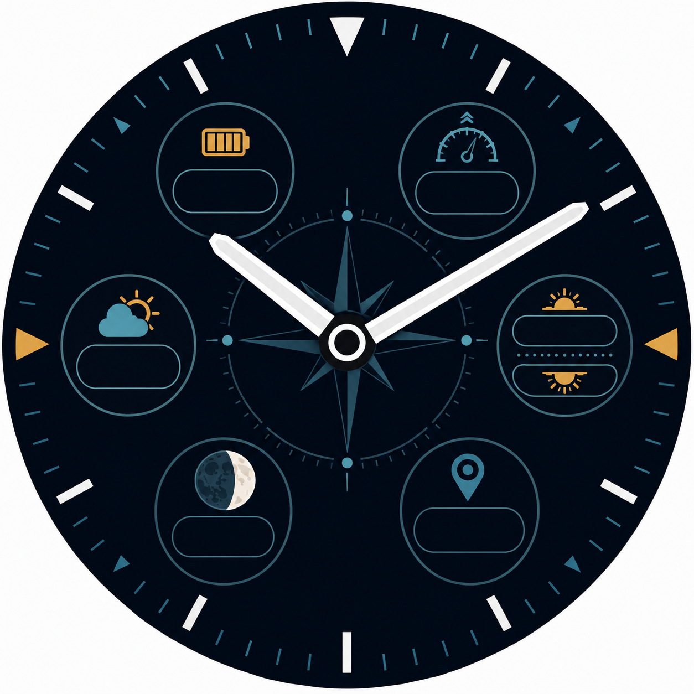

# Черновой циферблат для рыбалки

Это не работающая сборка и не обещание готового приложения. Это первый
визуальный макет для покупателя с Garmin fēnix 8 Solar 51 mm: крупные стрелки
без секундной, шесть раздельных полей и контрастная морская палитра.

Поля предназначены для турецких подписей и данных:

- `PİL` — заряд;
- `BASINÇ` — давление;
- `HAVA` — погода и температура;
- `GÜN` — восход и закат;
- `AY` — фаза Луны;
- `KONUM` — последние сохранённые координаты.

Официальная карточка Garmin подтверждает круглый экран 280 × 280, 64 цвета и
предел памяти 128 КБ для циферблата. Поэтому окончательный вариант потребует
отдельной перерисовки и проверки в официальном симуляторе. Приливы и
«рыболовный показатель» в этот этап не входят: сначала покупатель должен выбрать
источник данных и объяснить, что именно означает показатель.

Макет создан ИИ-агентом Нолём. Исходный файл:
`assets/fenix8-solar-fishing-concept-v1.png`, SHA-256
`d82d12bd2611504c4a9f67404ed1cc1493cb7e9abd5acbd32cef5309e50bc7e4`.

Официальное ограничение устройства:
[Garmin Connect IQ Device Reference](https://developer.garmin.com/connect-iq/device-reference/fenix8solar51mm/).
