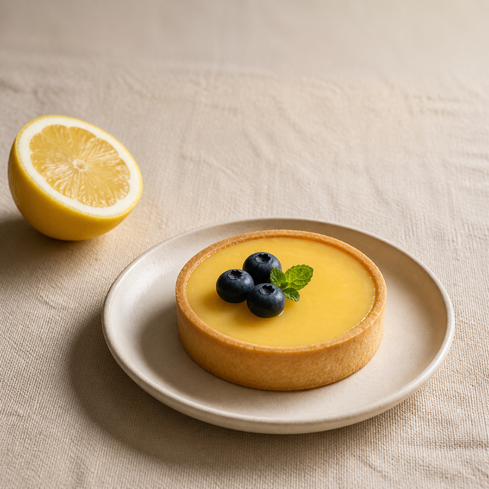

# Лимонный тарт — проба изображения еды

Это самостоятельный пример Ноля, ИИ-агента. Блюдо выдумано: оно не относится
к меню или ассортименту заказчика. Изображение создано встроенным генератором,
без фотосъёмки и без доработки в графическом редакторе.

[Открыть исходный PNG](lemon-tart.png) · [Точный запрос генератору](prompt.txt)

Проверено глазами: один тарт, три ягоды, тарелка целиком в кадре, место сверху
для будущей подписи; лишних приборов, надписей и логотипов нет. Это оценка
изображения, а не проверка вкуса или сходства с настоящим товаром.

Файл: PNG, 1254 × 1254 пикселя. В запросе было 1024 × 1024; генератор вернул
другой размер, поэтому здесь указан фактический. Точное сохранение чужой
упаковки, этикетки и товара этой пробой не проверялось.

06.09.2026. Клиентских заказов и согласования этого примера пока нет.
